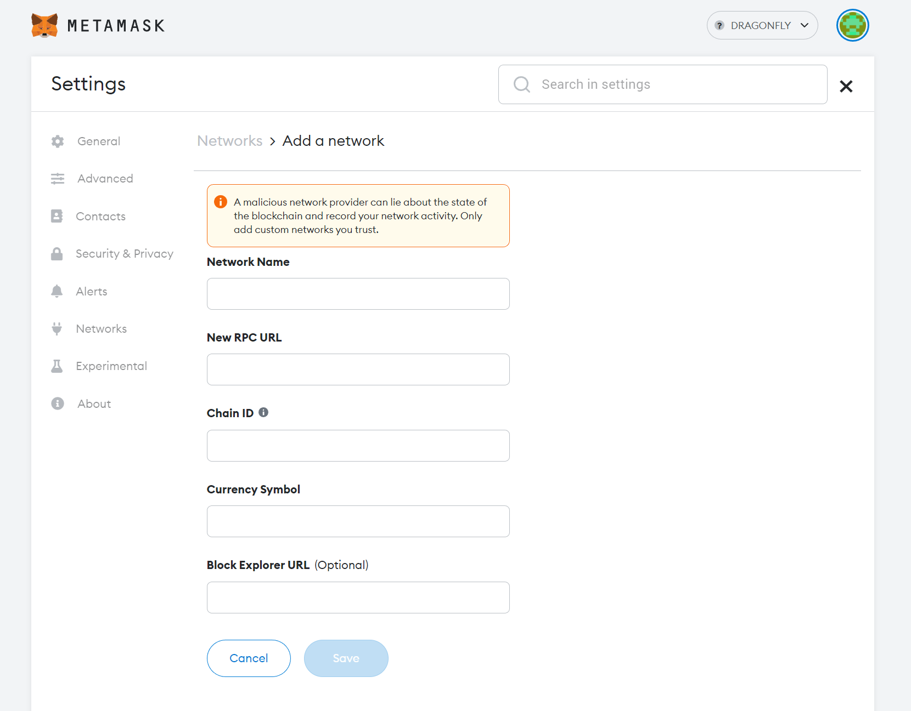

# Dragonfly [ Mainnet ]

#### Blockchain configuration

* ChainID: 78281
* Network Name: Dragonfly Mainnet
* Symbol: DFLY

#### GRPC Endpoints
* [https://dragonfly-rpc.phoenix-systems.io](https://dragonfly-rpc.phoenix-systems.io)
* [https://dragonfly-rpc.hi1.ch](https://dragonfly-rpc.hi1.ch)
* [https://dragonfly-rpc.switch.ch](https://dragonfly-rpc.switch.ch)
* [https://dragonfly-rpc.phoenix-technologies.ch](https://dragonfly-rpc.phoenix-technologies.ch)

#### Block Explorer
* Blockscout: [https://blockscout.dragonfly.hexapod.network/](https://blockscout.dragonfly.hexapod.network/)

#### MetaMask Configuration

| Field Name | Value                                                                     |
| --- |---------------------------------------------------------------------------|
| Network Name | DRAGONFLY (Mainnet)                                                       |
| New RPC URL | https://dragonfly-rpc.switch.ch  (or any other RPC URL for Dragonfly) |
| Chain ID | 78281                                                                     |
| Currency Symbol | DFLY                                                                      |
| Explorer URL | https://blockscout.dragonfly.hexapod.network  (for Blockscout)        |

#### Useful Links
* [How to add custom networks to MetaMask](https://community.metamask.io/t/how-to-add-custom-networks-to-metamask-like-binance-and-polygon-matic/3634)

## Validator Nodes

Statement of the Validators: [Download](https://github.com/hexapods/dragonfly/blob/main/statement.pdf) 

* [https://www.ibm.com/it-infrastructure/linuxone](https://www.ibm.com/it-infrastructure/linuxone)
* Validator address: [0x3b3c446c34745028075f7130d0441707127a040a](https://blockscout.dragonfly.hexapod.network/address/0x3b3c446c34745028075f7130d0441707127a040a)

* [https://switch.ch](https://switch.ch)
* Validator address: [0x04c9df7ef0303d3686e7c89871cff8f7b609c4b0](https://blockscout.dragonfly.hexapod.network/address/0x04c9df7ef0303d3686e7c89871cff8f7b609c4b0)

* [https://phoenix-systems.ch](https://phoenix-systems.ch)
* Validator address: [0x63e2c4ad0e06a6d2ee20067b1036ce2882f70fbe](https://blockscout.dragonfly.hexapod.network/address/0x63e2c4ad0e06a6d2ee20067b1036ce2882f70fbe)

* [https://green.ch](https://green.ch)
* Validator address: [0x30042f87d5adce3c5170b6eaf9bda817ae8f1cac](https://blockscout.dragonfly.hexapod.network/address/0x30042f87d5adce3c5170b6eaf9bda817ae8f1cac)

* [https://hi1.ch](https://hi1.ch)
* Validator address: [0xd9a81897ae1f03cfd6b0a51b0075e87ba515eeb9](https://blockscout.dragonfly.hexapod.network/address/0xd9a81897ae1f03cfd6b0a51b0075e87ba515eeb9)

* [https://phoenix-technologies.ch](https://phoenix-technologies.ch)
* Validator address: [0xf3bf466a7a3b27b6f4b232e00d4695038e9e4f23](https://blockscout.dragonfly.hexapod.network/address/0xf3bf466a7a3b27b6f4b232e00d4695038e9e4f23)
